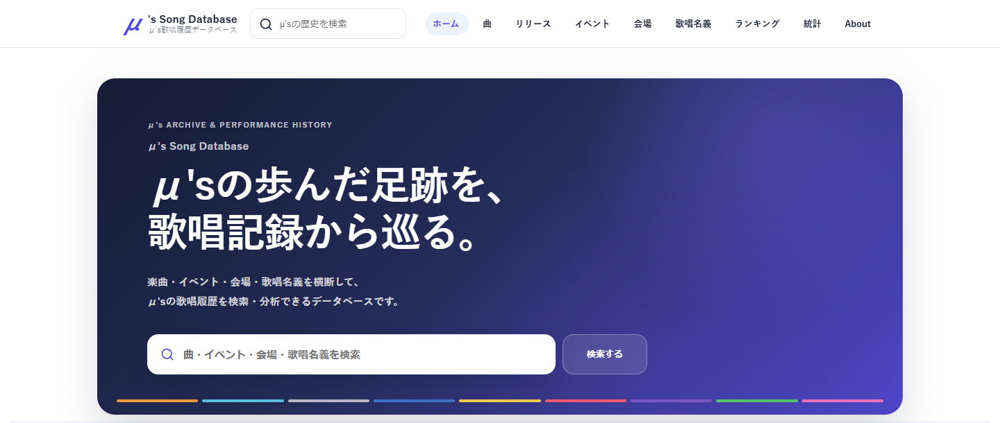

# μ's Song Database

μ'sの楽曲・イベント・会場・歌唱名義などを横断し、歌唱履歴を検索・分析できる非公式ファンデータベースです。

[Webサイトを見る](https://mus-song-db.com/)

## 主な機能

- 楽曲ごとの歌唱履歴と収録作品
- イベントごとの歌唱記録と、確認できている公演の曲順
- 会場ごとの開催・歌唱履歴
- 歌唱名義ごとの記録と、メンバー別歌唱記録の比較
- 楽曲・イベント・会場などを横断した検索
- 歌唱回数のランキングと年別統計
- いつ振り歌唱チェッカー

## データについて

楽曲、リリース、イベント、会場、歌唱名義と歌唱履歴をつなぎ、曲や公演をさまざまな入口からたどれます。確認できたイベントでは、歌唱順も記録しています。

## 技術概要

- GitHub Pagesで公開
- Vanilla JavaScriptによる画面表示
- Static JSONのスナップショットと、楽曲・リリース詳細の事前生成HTML
- Google Apps ScriptのPublic APIと連携

## ドキュメント

- [Setlist仕様](docs/setlist-spec.md) — 歌唱順の定義とデータ上の扱い

## このサイトについて

本サイトはファン個人による非公式のデータベースです。
公式および関係各社とは一切関係ありません。

掲載している作品名・楽曲名・人物名等の権利は、それぞれの権利者に帰属します。
